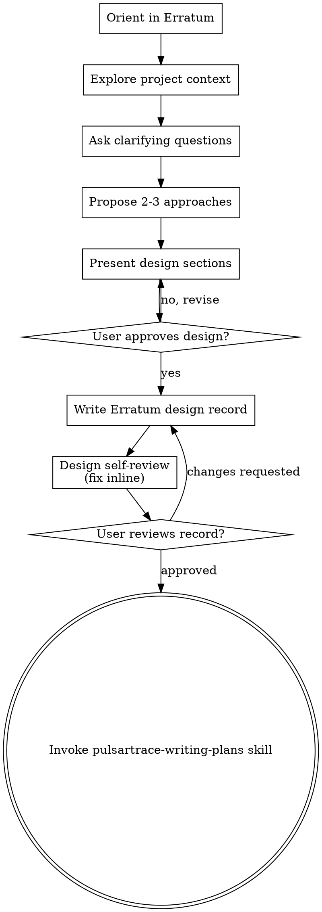

# Brainstorming Ideas Into Designs

Help turn ideas into fully formed designs through natural collaborative dialogue, and capture the result as an Erratum design record — a Project PRD for new scope, or an epic for a slice of an open project.

Start by understanding the current project context, then ask questions one at a time to refine the idea. Once you understand what you're building, present the design and get user approval, then write it into `.erratum/`.

**Announce at start:** "I'm using the pulsartrace-brainstorming skill to design this work."

**Load the `erratum` skill.** It is the operating manual for everything you write under `.erratum/`. You are the doc-owner: you derive IDs, choose change-types, and author the PRD, decision log, and epic specs by its rules. Read it before writing any `.erratum/` artifact.

## When to Use

Brainstorming is the design step for substantial new features and behaviour changes. Small bugfixes, mechanical edits, and trivial changes do not require it. For work that does go through brainstorming you present a design and get the user's approval before moving to a plan — but there is no absolute prohibition on writing any code anywhere.

## Where the design lives

Orient in `.erratum/` first (the `erratum` skill tells you how), then capture the approved design in one of two homes:

- **New scope → a new Project.** Open the next project under `.erratum/projects/P<n>-<slug>/` and write its **PRD** (`prd.md`): a Scope statement, then the **Project Requirements**, each carrying a type (Functional / Technical / Constraint) and a change-type against the product layer (Introduce, Supersede(PT-R*), or Retire(PT-R*)). Record the reasoning behind each significant choice in the **Decision Log** (`decisions.md`) as `PT-P<n>-D<m>` entries.
- **A slice of an already-open Project → an Epic.** Capture the design as the epic's `spec.md` **Intent** (written against the Project Requirement IDs and existing Component IDs it touches) and **Acceptance criteria**. The implementation detail and tasks are filled in by pulsartrace-writing-plans.

Project Requirements are mutable drafts for the whole life of the project — add, edit, or drop them freely as the design firms up. The product layer is untouched until project close-out.

## Checklist

You MUST create a task for each of these items and complete them in order:

1. **Orient in Erratum** — load the `erratum` skill; read `.erratum/` and locate yourself (is a project open? which epics are open?). Decide whether this work opens a new project or is an epic in an open one.
2. **Explore project context** — check the relevant product requirements, architecture components, recent decisions, and code.
3. **Ask clarifying questions** — one at a time; understand purpose, constraints, success criteria.
4. **Propose 2-3 approaches** — with trade-offs and your recommendation.
5. **Present design** — in sections scaled to their complexity; get user approval after each section.
6. **Write the Erratum design record** — the Project PRD (Scope + change-typed Project Requirements) and Decision Log entries for new scope, or the epic `spec.md` Intent + Acceptance criteria for a slice of an open project. Commit it.
7. **Design self-review** — quick inline check for placeholders, contradictions, ambiguity, scope (see below).
8. **User reviews the written design** — ask the user to read the PRD / epic spec before proceeding.
9. **Transition to planning** — invoke pulsartrace-writing-plans to decompose the design into epics and tasks.

## Process Flow

**The terminal state is invoking pulsartrace-writing-plans.** Do NOT invoke any other implementation skill. The ONLY skill you invoke after brainstorming is pulsartrace-writing-plans.

## The Process

**Understanding the idea:**

- Check out the current project state first: `.erratum/` (product requirements, architecture, open projects and epics) and the relevant code.
- Before asking detailed questions, assess scope: if the request describes multiple independent subsystems (e.g., "build a platform with chat, file storage, billing, and analytics"), flag this immediately. Don't spend questions refining details of a project that needs to be decomposed first.
- If the work is too large for a single project, help the user decompose it: what are the independent pieces, how do they relate, what order should they be built? Each piece becomes its own project (or a distinct epic) with its own design → plan → implementation cycle. Brainstorm the first piece through the normal flow.
- For appropriately-scoped work, ask questions one at a time to refine the idea.
- Prefer multiple choice questions when possible, but open-ended is fine too.
- Only one question per message — if a topic needs more exploration, break it into multiple questions.
- Focus on understanding: purpose, constraints, success criteria.

**Exploring approaches:**

- Propose 2-3 different approaches with trade-offs.
- Present options conversationally with your recommendation and reasoning.
- Lead with your recommended option and explain why.

**Presenting the design:**

- Once you believe you understand what you're building, present the design.
- Scale each section to its complexity: a few sentences if straightforward, up to 200-300 words if nuanced.
- Ask after each section whether it looks right so far.
- Cover: architecture, components, data flow, error handling, testing.
- Be ready to go back and clarify if something doesn't make sense.

**Design for isolation and clarity:**

- Break the system into smaller units that each have one clear purpose, communicate through well-defined interfaces, and can be understood and tested independently.
- For each unit, you should be able to answer: what does it do, how do you use it, and what does it depend on?
- Can someone understand what a unit does without reading its internals? Can you change the internals without breaking consumers? If not, the boundaries need work.
- Smaller, well-bounded units are also easier for you to work with — you reason better about code you can hold in context at once, and your edits are more reliable when files are focused. When a file grows large, that's often a signal that it's doing too much.

**Working in existing code:**

- Explore the current structure before proposing changes. Follow existing patterns.
- Where existing code has problems that affect the work (a file that's grown too large, unclear boundaries, tangled responsibilities), include targeted improvements as part of the design — the way a good developer improves code they're working in.
- Don't propose unrelated refactoring. Stay focused on what serves the current goal.

## After the Design

**Capture it in Erratum:**

- Write the approved design into `.erratum/` following the `erratum` skill — a Project PRD (Scope + change-typed Project Requirements) and Decision Log entries for new scope, or an epic `spec.md` Intent + Acceptance criteria for a slice of an open project.
- Each Project Requirement states a concrete, checkable outcome and carries its type and change-type. Each decision states what was chosen and why.
- Commit the design record to git.

**Design Self-Review:**
After writing the record, look at it with fresh eyes:

1. **Placeholder scan:** Any "TBD", "TODO", incomplete sections, or vague requirements? Fix them.
2. **Internal consistency:** Do any requirements or sections contradict each other? Does the architecture match the requirement descriptions?
3. **Scope check:** Is this focused enough for a single project/epic, or does it need decomposition?
4. **Ambiguity check:** Could any requirement be interpreted two different ways? If so, pick one and make it explicit.

Fix any issues inline. No need to re-review — just fix and move on.

**User Review Gate:**
After the self-review passes, ask the user to review the written record before proceeding:

> "Design written and committed to `<path>`. Please review it and let me know if you want any changes before we plan the implementation."

Wait for the user's response. If they request changes, make them and re-run the self-review. Only proceed once the user approves.

**Planning:**

- Invoke the pulsartrace-writing-plans skill to decompose the design into epics and tasks.
- Do NOT invoke any other skill. pulsartrace-writing-plans is the next step.

## Key Principles

- **One question at a time** — Don't overwhelm with multiple questions.
- **Multiple choice preferred** — Easier to answer than open-ended when possible.
- **YAGNI ruthlessly** — Remove unnecessary requirements from the design.
- **Explore alternatives** — Always propose 2-3 approaches before settling.
- **Incremental validation** — Present design, get approval before moving on.
- **Be flexible** — Go back and clarify when something doesn't make sense.

---

## Attribution

Adapted from the `brainstorming` skill in [Superpowers](https://github.com/obra/superpowers) by Jesse Vincent, MIT-licensed. Modified for the PulsarTrace project — see `ATTRIBUTION.md` in the skills directory for the full license text and the list of changes.
